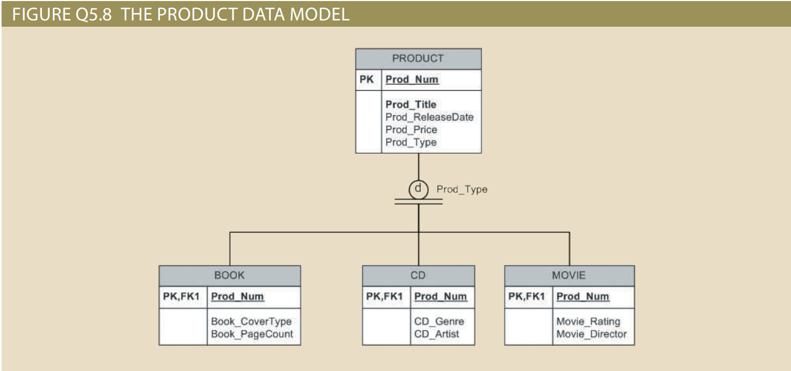

[](https://classroom.github.com/a/AToVUmyt)
[](https://classroom.github.com/online_ide?assignment_repo_id=21796620&assignment_repo_type=AssignmentRepo)
# Advanced Database Modeling

This repository is used to submit your work for the “Advanced database modeling” assignment.

The goal of this task is to:
- Practice reading and interpreting an enhanced ERD / data model.
- Apply conceptual database modeling terminology.
- Reason about primary keys, surrogate keys, composite keys, and 1:1 relationships.

---

## 1. Materials

1. Figure Q5.8 – The Product Data Model



The figure shows:

* A `PRODUCT` entity with attributes such as product number, title, release date, price, and type.
* Three subtypes: `BOOK`, `CD`, and `MOVIE`, each with their own specific attributes.
* A discriminator attribute `Prod_Type`.

2. Questions 1–8

   You will answer questions 1–8 based on your understanding of Figure Q5.8 and general ER modeling concepts.

---

## 2. Tasks

Create a file called `answers.md` (or `answers.pdf` / `answers.docx`) in this repository and provide clear, numbered answers to all of the following tasks.

### Tasks for Questions 1–3 (based on Figure Q5.8)

Q1. Movie attributes

1. Using Figure Q5.8, list all attributes that describe a movie.

   * Include both the attributes inherited from `PRODUCT` and the attributes specific to the `MOVIE` subtype.

---

Q2. PRODUCT–CD relationship

2. Based on the data model in Figure Q5.8, determine whether every row in `PRODUCT` must be related to a row in `CD`.

   * Answer Yes/No and justify your answer using the subtype/supertype structure and constraints shown in the figure.

---

Q3. BOOK without PRODUCT

3. Analyze whether it is possible for a row to exist in the `BOOK` table without a corresponding row in `PRODUCT`.

    * Answer Yes/No and explain your reasoning using primary key / foreign key dependencies and the supertype–subtype design.

---

### Conceptual Questions 4–8 (general ER modeling)

For Questions 4–8, answer in your own words. Use concise but complete explanations (2–6 sentences per answer).

Q4. Entity cluster

4. Explain what an entity cluster is in conceptual database modeling and describe the advantages of using entity clusters in large or complex ER diagrams.

---

Q5. Desirable properties of primary keys

5. List the main desirable characteristics of a primary key (for example: uniqueness, stability, minimality, etc.).

    * For each characteristic, briefly explain why it is important in database design.

---

Q6. Composite primary keys

6. Describe when it is appropriate to use a composite primary key.

    * Include at least one typical example scenario, such as an associative (bridge) entity between two tables.

---

Q7. Surrogate primary keys

7. Define a surrogate primary key and explain when and why you might choose a surrogate key instead of a natural key.

    * Mention at least one benefit and one potential drawback.

---

Q8. 1:1 relationship and foreign key placement

8. Consider a 1:1 relationship between two entities where one side is mandatory (must exist) and the other side is optional (may or may not exist).

    * Specify in which table you would place the foreign key.
    * Explain whether that foreign key should be mandatory (NOT NULL) or optional (NULL allowed) and justify your decision.

---

Example structure:

```text
.
├── product_data_model.png   # Figure Q5.8 (if provided by instructor)
├── README.md                # This file
└── answers.md               # Your answers to Q1–Q8
```

## 3. Academic Integrity

All answers must be written in your own words.
You may consult lecture slides, textbooks, and trusted online resources, but copy–paste of text or solutions is not allowed.

Happy modeling!
